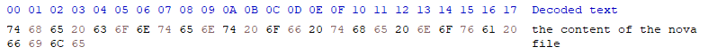
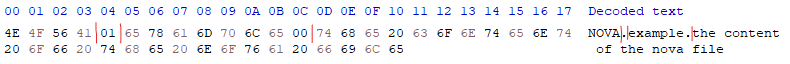
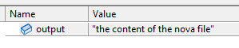

# NovaEngine

**Nova Engine** is a fully managed C# 3D game engine that's currently work in progress.

## Get Started
Currently there isn't an editor for nova, projects need to be created manually and without a GUI.

### Required Files
Right now a nova project requires a minimum or 2 files, `Data/InitialScenes.nova` and `Data/Scenes/[scene_name].novascene`.  
The `InitialScenes.nova` is a nova file that is just a serialised `string[]` whose names match exactly the names of the scenes in `Data/Scenes/` (without the extension) to load up when the program is initially run.
The `.novascene` files are nova files that are serialised `NovaEngine.SceneManagement.Scene` objects. // TODO: link to scene explanation

## Key Concepts

### Nova File Format
Nova has two file formats, `.nova` and `.novascene`, the content for both is identical and there is no restriction on what either format can store but conventionally scenes should be stored in `.novascene` files and everything else as a `.nova` file; this is so content files can be gitignored while the scenes can stay checked in.

The format consists of a header and an uncompressed byte stream, the content of which depends on how the nova file was [packed](#Packing)

Size (bytes) | Description
------------ | -----------
4            | UTF-8 characters `NOVA`.
1            | Version, this *must* be `1`.
?            | Content Type, this is a null-terminated UTF-8 string describing the type of content that is stored in the content section, used for choosing the correct [reader](#Reading) or [unpacker](#Unpacking).
?            | Content, this is passed to a [reader](#Reading) or [unpacker](#Unpacking) to be converted to an object in the engine or a non-nova file. // TODO: link to content pipeline basics

### Content Pipeline
The content pipeline consists of three types of processing, `packing`, `reading`, and `unpacking`.  
The content pipeline is able to detect any of the three types from any loaded assembly and they don't need to be public. This means mods, games, or tools can easily add custom processors without needing to expose them.

#### Packing
**Packing** is the process of converting a non-nova file into a nova file (e.g. converting a .png file into a .nova file) to be used later on. Packing is done so content can be stored in a way that is more efficiently read to decrease load times.

All packers inherit from `NovaEngine.ContentPipeline.Packers.IContentPacker`, this requires a content type (the one that will be copied into the file header), file extensions that the packer can process, and logic for reading from a `System.IO.FileStream` to process the content into a `System.IO.Stream`.

An example of a basic packer could look like:
```cs
using NovaEngine.ContentPipeline.Packers;

internal class ExamplePacker : IContentPacker
{
    public string Type { get; } = "example";
    public string[] Extensions { get; } = new[] { "test" };

    public Stream Write(FileStream fileStream)
    {
        var novaFileStream = new MemoryStream();
        fileStream.CopyTo(novaFileStream);
        return novaFileStream;
    }
}
```

This will process any file that has a `.test` extension and just copy the contents directly to the nova file, to use the packer you could create a file called `name.test` and call this code:
```cs
using NovaEngine.ContentPipeline;

internal class Program
{
    static void Main(string[] args)
    {
        Content.Pack("name.test", "novaFile");
    }
}
```

(This example just processes files relative to the .exe of the app being executed, you can specify a full path or a different relative path if desired.)

For example with the `name.test` file:



The output `novaFile.nova` file will have the contents:



#### Reading
**Reading** is the process of reading a nova file and converting into a C# object to be used in the application.

All readers inherit from `NovaEngine.ContentPipeline.Readers.IContentReader`, this requires a content type (the same one that was specified in the content packer), the types that the reader can output to, and logic for reading from a `System.IO.FileStream` to process the content into an `object`.

An example of a basic reader to go with the packer could look like:
```cs
using NovaEngine.ContentPipeline.Readers;

internal class ExampleReader : IContentReader
{
    public string Type { get; } = "example";
    public Type[] OutputTypes { get; } = new[] { typeof(string) };

    public object? Read(FileStream novaFileStream, Type outputType)
    {
        using var streamReader = new StreamReader(novaFileStream);
        return streamReader.ReadToEnd();
    }
}
```

In this example `outputType` is ignored, this is because we know it will always be a `string` as that's the only type the reader supports. If the reader supports multiple this can be used to determine which one should be returned.

This can be used to read the `novaFile.nova` that was created in with the [packer](#Packing), the code that could read that file as a `string` would look like:
```cs
using NovaEngine.ContentPipeline;

internal class Program
{
    static void Main(string[] args)
    {
        string output = Content.Load<string>("test");
    }
}
```



Unlike packers, the path specified to `Content.Load` isn't relative to the .exe, instead it's relative to the `/Data/` path in the folder the .exe is in.

#### Unpacking
**Unpacking** is the process of converting a nova file back into it's non-nova file form (e.g. converting a .nova file into a .png file). Not all nova files can be unpacked, nova files that where creating using the serialiser or content that can't be converted back without loosing data (e.g. fonts) can't be unpacked.

All unpackers inherit from `NovaEngine.ContentPipeline.Packers.IContentUnpacker`, this requires a content type (the same one that was specified in the content packer), file extension that the packer can output to, and logic for reading from a `System.IO.FileStream` to process the content into another `System.IO.FileStream`.

An example of a basic packer could look like:
```cs
using NovaEngine.ContentPipeline.Packers;

internal class ExampleUnpacker : IContentPacker
{
    public string Type { get; } = "example";
    public string Extension { get; } = "test";

    public void Write(FileStream novaFileStream, FileStream destinationFileStream)
    {
        novaFileStream.CopyTo(destinationFileStream);
    }
}
```

This will process any file that has a `example` content type and that has an output extension of `.test`  and just copy the contents directly from the nova file, to use the unpacker you could call this code:
```cs
using NovaEngine.ContentPipeline;

internal class Program
{
    static void Main(string[] args)
    {
        Content.Unpack("test", "output"); // this will pick any unpacker that can process the content type that nova file has in its header
        Content.Unpack("test", "output.test"); // this will pick an unpacker that can process the content type and can process an extension of 'test'
    }
}
```

(This example just processes files relative to the .exe of the app being executed, you can specify a full path or a different relative path if desired.)

## Building
Currently Nova Engine uses Vulkan for rendering, in order to develop with Nova Engine you will need the [Vulkan SDK](https://vulkan.lunarg.com/sdk/home) as well as the [.NET 7 SDK](https://dotnet.microsoft.com/en-us/download).  

Once installed, open the solution in Visual Studio and build the input handler, platform, and renderer first; afterwards the NovaEngine project. Due to how the input handler, platform, and renderer are loaded at runtime instead of being a project dependency, they won't automatically be built if building just the NovaEngine project.  

In order to be able to run an application you will need to set up a project as outlined in [Creating a project]() // TODO: link to section